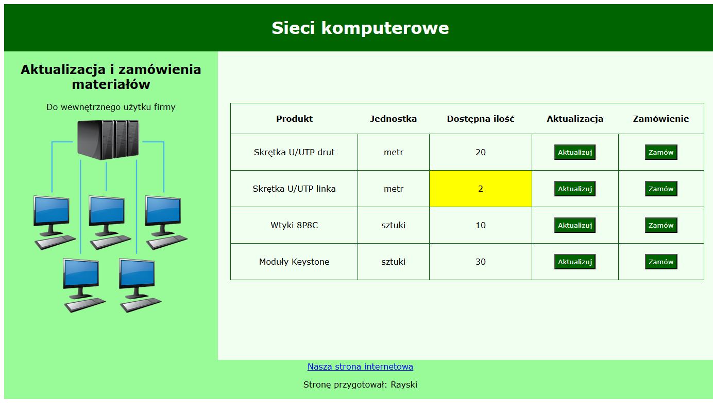

# Sieci komputerowe (Zamówienia) – projekt z egzaminu INF.03

To moja wersja projektu wykonanego w ramach ćwiczeń do egzaminu zawodowego z kwalifikacji INF.03. Aplikacja pozwala na zarządzanie ilością dostępnych produktów oraz składanie zamówień. Głównym celem było przećwiczenie pracy z tablicami elementów HTML (`NodeList`), obsługi zdarzeń oraz prostych instrukcji warunkowych.

## Funkcje

- Wyświetlanie listy produktów z nazwą i aktualną ilością
- Kolorowe oznaczenia ilości:
  - `0` – czerwony
  - `1–5` – żółty
  - `>5` – zielony (honeydew)
- Możliwość zmiany ilości produktów przez `prompt()`
- Obsługa przycisku "Zamów" – wyświetlenie komunikatu z nazwą produktu i numerem zamówienia

## Technologie użyte w projekcie

- **HTML** – struktura strony
- **CSS** – stylizacja elementów
- **JavaScript (Vanilla)** – obsługa kliknięć, logika zmiany ilości i system zamówień

## Jak to działa?

- Każdy produkt ma przypisaną nazwę, ilość oraz dwa przyciski: `Aktualizuj` i `Zamów`
- Po kliknięciu `Aktualizuj`, użytkownik wpisuje nową ilość przez `prompt()`. Kolory aktualizują się automatycznie, zależnie od podanej wartości.
- Kliknięcie `Zamów` wyświetla komunikat z nazwą produktu i automatycznie nadanym numerem zamówienia (np. "Zamówienie nr: 3 Produkt: Moduły Keystone")

## Zobacz demo

### Podgląd działania

### Link do testu
[Demo zadania egzaminacyjnego](https://rayskidev.github.io/zamowienia-inf03/)

## Dodatkowe informacje

- Projekt nie zawiera walidacji wpisywanych danych, ponieważ nie było to wymagane w treści zadania egzaminacyjnego.  
- Numer zamówienia zwiększa się automatycznie przy każdym kliknięciu dowolnego przycisku "Zamów".
- Ze względu na wymóg z arkusza dotyczący wysokości pola `main` (500px + 100px padding), jego całkowita wysokość przekracza wysokość pola `aside` (wymagane 500px), więc aby zachować układ strony i zgodność wizualną, uwzględniłem dodatkowe 100px odstępując od dokładnych wytycznych egzaminacyjnych.
